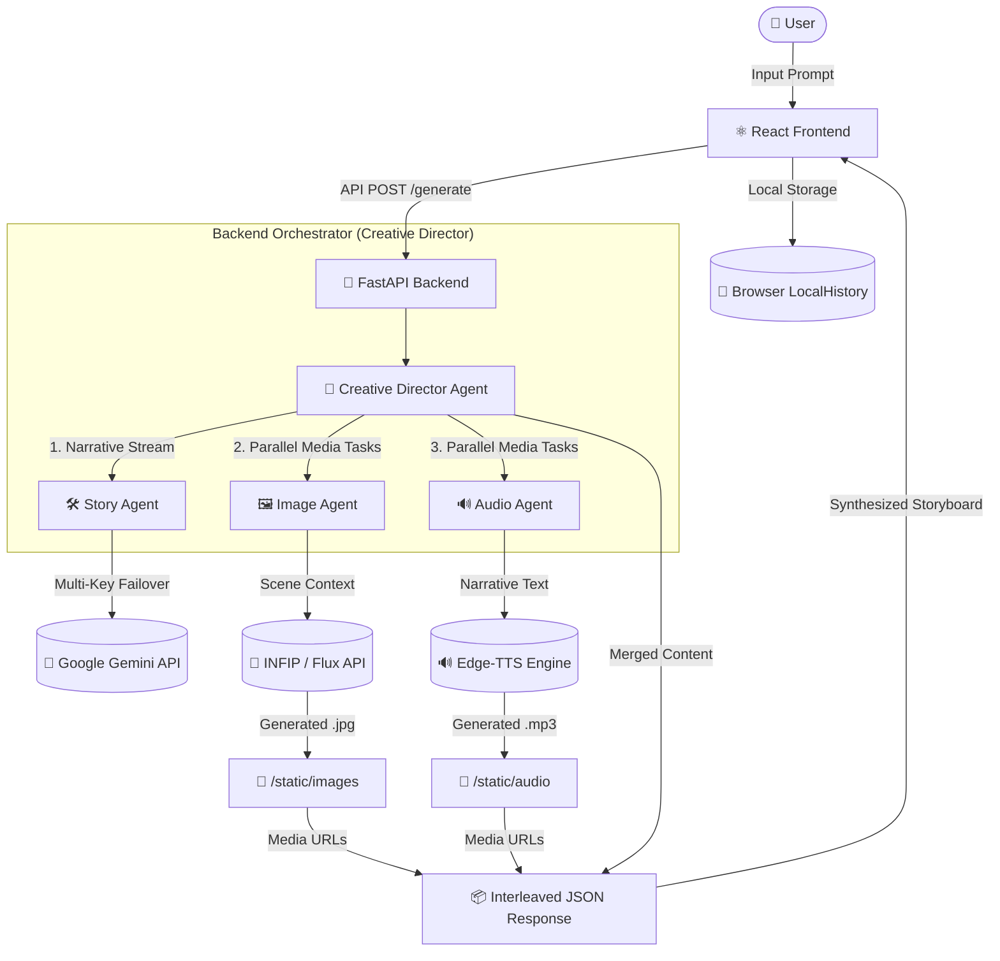

# 🏗️ System Architecture: Gemini Creative Storyteller

This document provides a clear visual and technical representation of how the **Gemini Creative Storyteller** platform operates, from the user's prompt to the final cinematic storyboard. For setup and usage, see [INSTRUCTIONS.md](INSTRUCTIONS.md) or [README.md](README.md).

---

## 📊 High-Level Flow (Mermaid Diagram)

---

## 🧩 Component Breakdown

### 1. ⚛️ Frontend (React / Vite)
*   **Role**: The "Cinematic Dashboard."
*   **Tech**: TailwindCSS (Glassmorphism), Lucide Icons, Axios.
*   **Logic**: Manages asynchronous state for streaming content. It stores generated story IDs in `LocalHistory` so users can revisit their adventures without a server-side database.

### 2. 🐍 Backend Orchestrator (FastAPI)
*   **Creative Director Agent**: The "Brain." It parses the raw LLM output from Gemini, identifies where scenes transition, and triggers the Image and Audio agents simultaneously (Parallel Processing).
*   **Failover Logic**: A critical layer that manages a pool of 14+ Google API keys to ensure that even if one key hits a rate limit, the story continues uninterrupted.

### 3. 🤖 AI Infrastructure
*   **Google Gemini (Story Agent)**: Used for long-form narrative generation and visual prompt engineering.
*   **INFIP / Flux (Image Agent)**: A high-performance image engine that generates 1024x1024 cinematic visuals for every scene.
*   **Edge-TTS (Audio Agent)**: Converts the narrative into high-quality neural speech, providing an immersive "movie-like" experience.

---

## 🔄 Data Lifecycle

1.  **Prompting**: The user submits a creative idea (e.g., *"A steampunk city in the clouds"*).
2.  **Synthesis**: The **Creative Director** queries Gemini. As text is generated, the Director extracts "Scene Visuals."
3.  **Parallel Production**: While the story continues to write, the **Image Agent** and **Audio Agent** work in parallel in the background.
4.  **Interleaving**: The backend waits for all media for a specific scene to be ready before packaging it into a "Story Node."
5.  **Delivery**: The frontend receives a rich JSON object containing text, image URLs, and audio URLs, rendering them in a cinematic scrolling timeline.

---

## 🛡️ Resilience: The Failover System
To meet the "Production Ready" criteria, the system connects to Google services using a cascading failover loop:
- **Primary Request** -> *Success*
- **Primary Request** -> *Fail (429/Quota)* -> **Rotate to Key 2** -> **Retry**
- This ensures the project remains functional even under heavy judging/testing stress.
